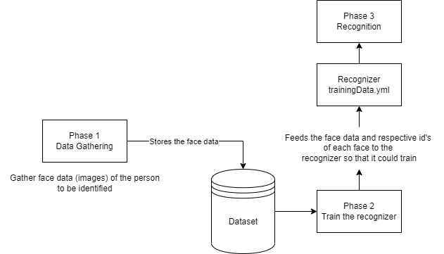

# Real-time Face Recognition

This project is created by using OpenCV library, OpenCV 
was designed for computational efficiency and with a 
strong focus on real-time applications. So, it’s perfect for 
real-time face recognition using a camera


## Project working Phases

To achieve face recognition successfully, the project is divided into 3 phases:

1. Face Detection and Data gathering
2. Training the Gathered Data
3. Face recognition


## Documentation

### Intent
The purpose is to identify and authenticate a person using a set of recognizable and verifiable data unique and specific to that person.

### Working of Face Recognition

- Face detection
    
    The camera detects and locates the image of a face, either alone or in a crowd. The image may show the person looking straight ahead or in profile.
- Face analysis

    Next, an image of the face is captured and analyzed. Next, an image of the face is captured and analyzed. 
- Converting the image to data

    The face capture process transforms analog information (a face) into a set of digital information (data) based on the person's facial features. Your face's analysis is essentially turned into a mathematical formula. The numerical code is called a faceprint. 
- Finding a match

    Your faceprint is then compared against a database of other known faces. Your faceprint is then compared against a database of other known faces.


## Working Flow of Face Recognition




## How to run the project

You have to open command-prompt/terminal in order to execute the project.
Once done with the launching of terminal, execute the following command

```bash
  python Main.py
```

